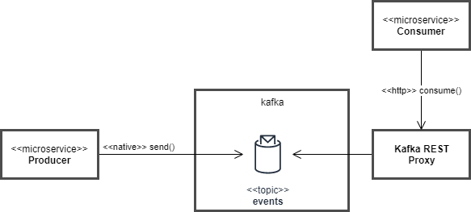
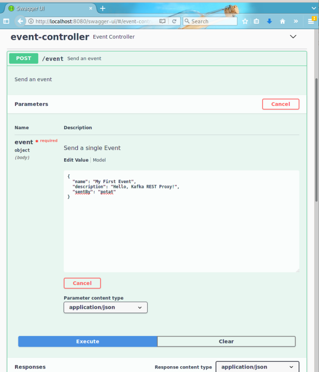

Table of Contents
=================

  * [Introduction](#kafka-rest-proxy-clients-example)
  * [Requirements](#requirements)
  * [Instructions](#instructions)
     * [Clone the repository](#clone-the-repository)
     * [Start the Kafka and REST Proxy](#start-the-kafka-and-rest-proxy)
     * [Start the Producer](#start-the-producer)
     * [Start the Consumer](#start-the-consumer)
     * [Send a Test Message](#send-a-test-message)
     * [Verify w/Consumer](#verify-wconsumer)

# Kafka REST Proxy Clients (Example)

This project provides an example producer and consumer for [Kafka REST Proxy](https://docs.confluent.io/platform/current/kafka-rest/index.html) 
and implemented in [Springboot](https://spring.io/projects/spring-boot).



## Requirements
You will need:
- [JDK 14+](https://adoptopenjdk.net/) 
- [Maven](https://maven.apache.org/download.cgi)
- [Docker](https://www.docker.com/products/docker-desktop)
- a clone of _this_ repository

## Instructions
### Clone the repository
 
```bash
$ git clone https://github.com/autofinance/krp-springboot-example.git krp
$ cd krp
```

### Start the Kafka and REST Proxy

```
$ docker-compose up -d
Creating network "krp_localnet" with the default driver
Creating krp_zookeeper_1 ... done
Creating krp_kafka_1     ... done
Creating krp_schema-registry_1 ... done
Creating krp_kafka-rest_1         ... done
Creating krp_schema-registry-ui_1 ... done
Creating krp_kafka-ui_1           ... done

```

### Start the Producer

```
$ cd producer
$ mvn spring-boot:run
[INFO] Scanning for projects...
[INFO] 
[INFO] -------------------< autofin.eda.restproxy:producer >-------------------
[INFO] Building producer 0.0.1-SNAPSHOT
[INFO] --------------------------------[ jar ]---------------------------------

--- snip ---

  .   ____          _            __ _ _
 /\\ / ___'_ __ _ _(_)_ __  __ _ \ \ \ \
( ( )\___ | '_ | '_| | '_ \/ _` | \ \ \ \
 \\/  ___)| |_)| | | | | || (_| |  ) ) ) )
  '  |____| .__|_| |_|_| |_\__, | / / / /
 =========|_|==============|___/=/_/_/_/
 :: Spring Boot ::                (v2.4.2)

2021-02-16 06:52:02.833  INFO 3940101 --- [           main] a.e.r.producer.ProducerApplication       : Starting ProducerApplication using Java 14.0.1 on banshee with PID 3940101 (/home/bashar/dev/autofin/spikes/kafka-rest-proxy-demo/producer/target/classes started by bashar in /home/bashar/dev/autofin/spikes/kafka-rest-proxy-demo/producer)
2021-02-16 06:52:02.835  INFO 3940101 --- [           main] a.e.r.producer.ProducerApplication       : No active profile set, falling back to default profiles: default
2021-02-16 06:52:03.777  INFO 3940101 --- [           main] o.s.b.w.embedded.tomcat.TomcatWebServer  : Tomcat initialized with port(s): 8080 (http)
2021-02-16 06:52:03.785  INFO 3940101 --- [           main] o.apache.catalina.core.StandardService   : Starting service [Tomcat]
2021-02-16 06:52:03.786  INFO 3940101 --- [           main] org.apache.catalina.core.StandardEngine  : Starting Servlet engine: [Apache Tomcat/9.0.41]
2021-02-16 06:52:03.838  INFO 3940101 --- [           main] o.a.c.c.C.[Tomcat].[localhost].[/]       : Initializing Spring embedded WebApplicationContext
2021-02-16 06:52:03.838  INFO 3940101 --- [           main] w.s.c.ServletWebServerApplicationContext : Root WebApplicationContext: initialization completed in 963 ms
2021-02-16 06:52:04.278  INFO 3940101 --- [           main] o.s.b.a.e.web.EndpointLinksResolver      : Exposing 2 endpoint(s) beneath base path '/actuator'
2021-02-16 06:52:04.364  INFO 3940101 --- [           main] o.s.s.concurrent.ThreadPoolTaskExecutor  : Initializing ExecutorService 'applicationTaskExecutor'
2021-02-16 06:52:04.536  INFO 3940101 --- [           main] o.s.b.w.embedded.tomcat.TomcatWebServer  : Tomcat started on port(s): 8080 (http) with context path ''
2021-02-16 06:52:04.672  INFO 3940101 --- [           main] a.e.r.producer.ProducerApplication       : Started ProducerApplication in 2.093 seconds (JVM running for 2.316)

```
The `Producer` has a [SwaggerUI](https://swagger.io) could be reached at `http://localhost:8080/swagger-ui/`.

### Start the Consumer
Open another terminal and navigate to the cloned repository.
```bash

$ cd <path-to>/krp
$ cd consumer
$ mvn spring-boot:run
[INFO] Scanning for projects...
[INFO] 
[INFO] -------------------< autofin.eda.restproxy:consumer >-------------------
[INFO] Building consumer 0.0.1-SNAPSHOT
[INFO] --------------------------------[ jar ]---------------------------------

--- snip --

.   ____          _            __ _ _
/\\ / ___'_ __ _ _(_)_ __  __ _ \ \ \ \
( ( )\___ | '_ | '_| | '_ \/ _` | \ \ \ \
\\/  ___)| |_)| | | | | || (_| |  ) ) ) )
'  |____| .__|_| |_|_| |_\__, | / / / /
=========|_|==============|___/=/_/_/_/
:: Spring Boot ::                (v2.4.2)

2021-02-16 06:58:58.453  INFO 3941429 --- [           main] a.e.r.consumer.ConsumerApplication       : Starting ConsumerApplication using Java 14.0.1 on banshee with PID 3941429 (/home/bashar/dev/autofin/spikes/kafka-rest-proxy-demo/consumer/target/classes started by bashar in /home/bashar/dev/autofin/spikes/kafka-rest-proxy-demo/consumer)
2021-02-16 06:58:58.455  INFO 3941429 --- [           main] a.e.r.consumer.ConsumerApplication       : No active profile set, falling back to default profiles: default
2021-02-16 06:58:59.063  INFO 3941429 --- [           main] o.s.b.w.embedded.tomcat.TomcatWebServer  : Tomcat initialized with port(s): 18080 (http)
2021-02-16 06:58:59.069  INFO 3941429 --- [           main] o.apache.catalina.core.StandardService   : Starting service [Tomcat]
2021-02-16 06:58:59.070  INFO 3941429 --- [           main] org.apache.catalina.core.StandardEngine  : Starting Servlet engine: [Apache Tomcat/9.0.41]
2021-02-16 06:58:59.115  INFO 3941429 --- [           main] o.a.c.c.C.[Tomcat].[localhost].[/]       : Initializing Spring embedded WebApplicationContext
2021-02-16 06:58:59.115  INFO 3941429 --- [           main] w.s.c.ServletWebServerApplicationContext : Root WebApplicationContext: initialization completed in 629 ms
2021-02-16 06:58:59.309  INFO 3941429 --- [           main] a.eda.restproxy.consumer.EventListener   : Deleting consumer instance consumer-1
2021-02-16 06:58:59.592  WARN 3941429 --- [           main] a.eda.restproxy.consumer.EventListener   : org.springframework.web.client.HttpClientErrorException$NotFound: 404 Not Found: [{"error_code":40403,"message":"Consumer instance not found."}]
2021-02-16 06:58:59.593  INFO 3941429 --- [           main] a.eda.restproxy.consumer.EventListener   : Creating consumer instance consumer-1
2021-02-16 06:58:59.766  INFO 3941429 --- [           main] a.eda.restproxy.consumer.EventListener   : {instance_id=consumer-1, base_uri=http://192.168.169.30:8082/consumers/consumer-group-1/instances/consumer-1}
2021-02-16 06:58:59.766  INFO 3941429 --- [           main] a.eda.restproxy.consumer.EventListener   : Subscribing to events
2021-02-16 06:58:59.854  INFO 3941429 --- [           main] o.s.s.concurrent.ThreadPoolTaskExecutor  : Initializing ExecutorService 'applicationTaskExecutor'
2021-02-16 06:59:00.000  INFO 3941429 --- [           main] o.s.s.c.ThreadPoolTaskScheduler          : Initializing ExecutorService 'taskScheduler'
2021-02-16 06:59:00.022  INFO 3941429 --- [           main] o.s.b.w.embedded.tomcat.TomcatWebServer  : Tomcat started on port(s): 18080 (http) with context path ''
2021-02-16 06:59:00.031  INFO 3941429 --- [   scheduling-1] a.eda.restproxy.consumer.EventListener   : Listening for events from events
2021-02-16 06:59:00.033  INFO 3941429 --- [           main] a.e.r.consumer.ConsumerApplication       : Started ConsumerApplication in 1.845 seconds (JVM running for 2.102)

```

### Send a Test Message

- Open a browser and point it to `http://localhost:8080/swagger-ui/` (`Producer`).
- Locate the `event-controller`
- Expand the `POST /event` endpoint by clicking on it
- Click on the button labeled `Try it out`
- Fill in the `event` model's text box with the following:
```
{
  "name": "My First Event",
  "description": "Hello, Kafka REST Proxy!",
  "sentBy": "potat"
}
```
- Click on the blue `Execute` button.



### Verify w/Consumer 
Verify that the message was received by switching to the console/terminal running the `Consumer`.
You should see something similar to the following:

```
2021-02-16 07:06:39.356  INFO 3941429 --- [   scheduling-1] a.eda.restproxy.consumer.EventListener   : Listening for events from events
2021-02-16 07:06:51.402  INFO 3941429 --- [   scheduling-1] a.eda.restproxy.consumer.EventListener   : Got event: Event(id=b328c374-0f37-45f7-a8bc-9eb3248fb9cf, created=2021-02-16T07:06:46, name=My First Event, description=Hello, Kafka REST Proxy!, sentBy=potat)
2021-02-16 07:06:56.402  INFO 3941429 --- [   scheduling-1] a.eda.restproxy.consumer.EventListener   : Listening for events from events
```
